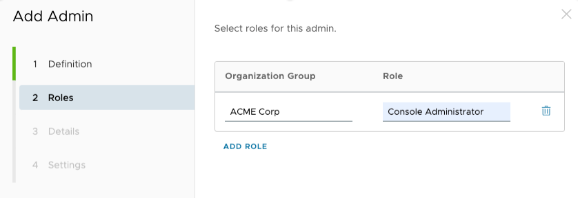

### Blog Post: Securely Accessing Workspace ONE API with PKCS#12 Certificates

#### Overview

A common customer request is to access the Workspace ONE UEM API to enhance their reporting or automated tasks. The APIs requires authentication in order to execute any request against the Workspace ONE UEM instance, those requests can be authenticated using basic credentials (username/password), certificates and OAuth. During the development of those reports or automated tasks, the basic credentials are used as method of authentication. However, when moved into production, this is no longer the best practice to access the APIs because you have to share those with other team members.
The alternative methods that follow security best practices is to leverage certificates or OAuth for authentication. This guide will instruct you on one way of doing this securely using certificate-based authentication.

#### Introduction
In this tutorial, we'll walk you through the process of creating a certificate in your Workspace ONE console, downloading it securely, and using it in a Python
script to make authenticated API calls. Additionally, we'll show how to generate signed data and use it in Postman for API testing.

#### Audience

This tutorial is intended for IT professionals and Administrators who utilize Workspace ONE UEM.

#### Requirements

This tutorial uses Python as the language to demonstrate the features. Some great guides are online if you do not have Python installed already, below a couple of recommendations, but these are not set in stone.

#### For Mac

We recommend the use of a common developer tool called [Brew](https://brew.sh/) to handle installation on a Mac and a Brew package called [pyenv](https://formulae.brew.sh/formula/pyenv) to set you up to install any version of Python you like on your Mac. Open a terminal on your Mac and execute the following commands.
```bash
# Install brew
/bin/bash -c "$(curl -fsSL https://raw.githubusercontent.com/Homebrew/install/HEAD/install.sh)"
# Install pyenv
brew install pyenv
# this will install Python 3.10.xx ( the latest version ) as well as pip3.
pyenv install 3.10
# The local command configures your current terminal session to run this version of python.  pyenv local 3.10
# If you like this version and want to use it by default, run this command:
pyenv global 3.10
# next you need pip to be set to default ( because tutorials don’t use pip3 ).
pip3 install –upgrade pip
# Finally, you need to install the requirements for our script, which needs the following packages: python-dotenv, cryptography, and requests.
pip install python-dotenv cryptography requests

```

#### For Windows

In order to make things simple, we recommend using the Microsoft Store and installing Python from there, the 3.10 version it is stable and used on this tutorial, but you can use whichever version you like.

1. Open the Microsoft Store
2. Search for Python
3. Install Python 3.10
4. Open a command prompt and type python --version to verify the installation


Once Python is installed you can install the packages in the same way:
```bash
pip install python-dotenv cryptography requests
```

### Step-by-Step Instructions


### Step 1: Create Your Certificate in Workspace ONE Console

1. **Log in to Workspace ONE**:

    * Navigate to your Workspace ONE console and log in with your admin credentials.
2. **Create a Certificate**:

    * Go to `Accounts` > `Administrators` > `List View`
    * Click on `Add` > `Add Admin` > `Basic`
        * I am using the `Basic` option for this example. You can choose the appropriate role based on your requirements.
    * Fill in the Username, Password, Confirm Password, First Name, Last Name, and Email
        * Make sure to set a strong password for the certificate.
      
    

    * Click Next
    * Give your admin user a Role appropriate for your needs
   
    
   
    * Click Next
    * Fill in any other details you like
    * Click Next
    * At the bottom of the next screen select the `Certificate` checkbox
    * Fill in a password to use as your certificate password
    * Click `Save`
    * Click `Continue` if you see a dialog pop up.

    
    * Now fill in the certificate password once again and then click `EXPORT CERTIFICATE`

    
    * Save the certificate to your computer in a secure location such as `~/.ssh`
    * Click `Save`

### Step 2: Create a `.env` File in a secure location

1. **Create a `.env` File**:

    * In a safe folder such as your `~/.ssh` if you are on a mac or any safe directory, create a file named `.env`.
2. **Store Environment Variables**:

    * Open the `.env` file in a text editor and add the following lines, replacing placeholder values with your actual credentials and file names:

```bash 
USER=the_username_you_created
HOST=hostname_of_your_workspace_one_api
APIKEY=your_api_key
CERTNAME=the_filename_of_your_certificate_without the extension
CERTPASSWORD=your_certificate_password
```

### Step 3: Full Python Script Using the `.env` File

The following code is a Python script that uses the requests library to make an authenticated API call to your Workspace ONE UE API. The script reads the certificate file from the specified path, generates signed data using the certificate, and sends the API request with the signed data in the Authorization header.

Copy the following script into a text file and save as getlistofdevices.py, update the directory folder to where is located your .env and .p12 files.

The script will call an UEM API to get a list of all devices and print the result on the screen.


```python
import base64
from cryptography.hazmat.primitives.serialization import pkcs12, pkcs7
from cryptography.hazmat.primitives import hashes, serialization
import requests
import os
from dotenv import load_dotenv

# Load environment variables from .env
load_dotenv('.env')

cert_password = os.getenv('CERTPASSWORD')
# Update with your actual certificate path
CERTNAME = os.getenv('CERTNAME')
cert_path = f"{CERTNAME}.p12"

# Host and signing data for the API call
host = os.getenv('HOST')
signing_data = "/api/mdm/devices/search"
url = f"https://{host}{signing_data}"

# Read the certificate file
with open(cert_path, 'rb') as certfile:
    cert = certfile.read()

# Load the key and certificate
key, certificate, additional_certs = pkcs12.load_key_and_certificates(cert, cert_password.encode())

# Define PKCS#7 signing options
options = [pkcs7.PKCS7Options.DetachedSignature]

# Create the signed data
signed_data = pkcs7.PKCS7SignatureBuilder() \
    .set_data(signing_data.encode("UTF-8")) \
    .add_signer(certificate, key, hashes.SHA256()) \
    .sign(serialization.Encoding.DER, options)

# Encode the signed data in base64
signed_data_b64 = base64.b64encode(signed_data).decode()
#
# print(f"Signed data from postman: {signed_data_b64}")

# Define headers for the API request
headers = {
    "User-Agent": os.getenv('USER'),
    "aw-tenant-code": os.getenv('APIKEY'),
    "Host": host,
    "Authorization": f"CMSURL'1 {signed_data_b64}",
    'Accept': 'application/json',
    "version": "1",
}

# Make the API request
response = requests.get(url, headers=headers)

# print the following in a table: DeviceFriendlyName, DeviceId, DeviceModel, DeviceOSVersion, EnrollmentStatus, LastSeen
print(f"""
--------------------------------------------------------------------------------------------------------------------------------
DeviceFriendlyName        | DeviceId  | DeviceModel       | Platform       | EnrollmentStatus      | LastSeen
--------------------------------------------------------------------------------------------------------------------------------
""")
for device in response.json()['Devices']:
    print(
        f"{device['DeviceFriendlyName']} | {device['Id']['Value']} | {device['Model']} | {device['Platform']} | {device['EnrollmentStatus']} | {device['LastSeen']}")
    print(f"--------------------------------------------------------------------------------------------------------------------------------")
# print the total number of devices
print(f"Total number of devices: {len(response.json()['Devices'])}")

```

A successful script execution will print the headers.

To run the script, execute the following command in your terminal:

```bash
python3 getlistofdevices.py
````


### Why We Are Using the `.env` File

Using a `.env` file helps in managing sensitive information securely and keeping the code clean. Environment variables stored in a `.env` file can be easily
loaded into your application without hardcoding sensitive data directly into the source code. This approach also allows you to manage different configurations
for development, testing, and production environments.

### Conclusion

In this tutorial, we've shown you how to create a certificate in your Workspace ONE console, download it securely, and use it in a Python script to make
authenticated API calls. By following these steps, you can securely access your Workspace ONE API and retrieve data using signed data for authentication.

### Extra Credit: Generating Signed Data and Using it in Postman

#### Generating Signed Data with Python

Run the following Python script to generate the signed data. The `signed_data_b64` variable will contain the base64-encoded 
signed data needed for the `Authorization` header in your API calls.

The script will print out the headers for you to copy and paste into Postman.

```python
import base64
from cryptography.hazmat.primitives.serialization import pkcs12, pkcs7
from cryptography.hazmat.primitives import hashes, serialization
import os
from dotenv import load_dotenv

# Load environment variables from ~/.ssh/.env
load_dotenv('/Users/leon/.ssh/.env')

cert_password = os.getenv('CERTPASSWORD')
# Update with your actual certificate path
CERTNAME = os.getenv('CERTNAME')
cert_path = f"/Users/leon/.ssh/{CERTNAME}.p12"

# Host and signing data for the API call
host = os.getenv('HOST')
signing_data = "/api/mdm/devices/search"
url = f"https://{host}{signing_data}"

# Read the certificate file
with open(cert_path, 'rb') as certfile:
    cert = certfile.read()

# Load the key and certificate
key, certificate, additional_certs = pkcs12.load_key_and_certificates(cert, cert_password.encode())

# Define PKCS#7 signing options
options = [pkcs7.PKCS7Options.DetachedSignature]

# Create the signed data
signed_data = pkcs7.PKCS7SignatureBuilder() \
    .set_data(signing_data.encode("UTF-8")) \
    .add_signer(certificate, key, hashes.SHA256()) \
    .sign(serialization.Encoding.DER, options)

# Encode the signed data in base64
signed_data_b64 = base64.b64encode(signed_data).decode()

# here is a table of the headers
print(f"""
------------------------------------
Name           | Value
------------------------------------
User-Agent     | {os.getenv('USER')}
aw-tenant-code | {os.getenv('APIKEY')}
Host           | {host}
Authorization  | CMSURL'1 {signed_data_b64}
Accept         | application/json
version        | 1
""")
```

A successful script execution will print the headers.

To run the script, execute the following command in your terminal:

```bash
python3 get_headers.py
````


4. **Setup Environment in Postman**:

    * Go to the `Environments` tab in Postman.
    * Click `Add` to create a new environment.
    * Add the following variables:

```bash
USER
HOST
APIKEY
SIGNED_DATA
```

    * Set the values for `USER`, `HOST`, and `APIKEY` based on your `.env` file. For `SIGNED_DATA`, use the base64-encoded signed data generated by your Python
      script.

2. **Create a New Request**:

    * Create a new GET request.
    * Set the URL to `https://{{HOST}}/api/mdm/devices/search`.

3. **Add Headers**:

* Add the following headers:

```text
User-Agent: {{USER}}
aw-tenant-code: {{APIKEY}} 
Host: {{HOST}} 
Authorization: CMSURL'1 {{SIGNED_DATA}}
Accept: application/json 
version: 1
```


How the output should look in Postman


4. **Send the Request**:

    * Click `Send` to make the API call.
    * Get your devices list.

By following these steps, you can securely generate and use signed data for authenticated API calls, both in your Python scripts and Postman.

### Summary and Additional Resources

In this tutorial, we’ve shown you how to create a certificate in your Workspace ONE console, download it securely, and use it in a Python script to make authenticated API calls and generate signed data to use in Postman. By following these steps, you can securely access your Workspace ONE API and retrieve data using signed data for authentication.


### Additional Resources

To learn more about Workspace ONE UEM API and the tools used on this article, you can explore the following resources:

1. [Workspace ONE API Documentation](https://docs.omnissa.com/bundle/WorkspaceONE-UEM-Console-BasicsVSaaS/page/UsingUEMFunctionalityWithRESTAPI.html#create_an_oauth_client_to_use_for_api_commands_saas)
2. [Cryptography Library Documentation](https://cryptography.io/en/latest/)
3. [Requests Library Documentation](https://docs.python-requests.org/en/master/)
4. [Postman Documentation](https://learning.postman.com/docs/getting-started/introduction/)
5. [Postman collection of Workspace ONE API](https://www.postman.com/vmw-euc/workspace/workspace-one-uem-apis/overview/)
5. [Dotenv Library Documentation](https://pypi.org/project/python-dotenv/)
6. [PKCS#12 File Format](https://en.wikipedia.org/wiki/PKCS_12)


